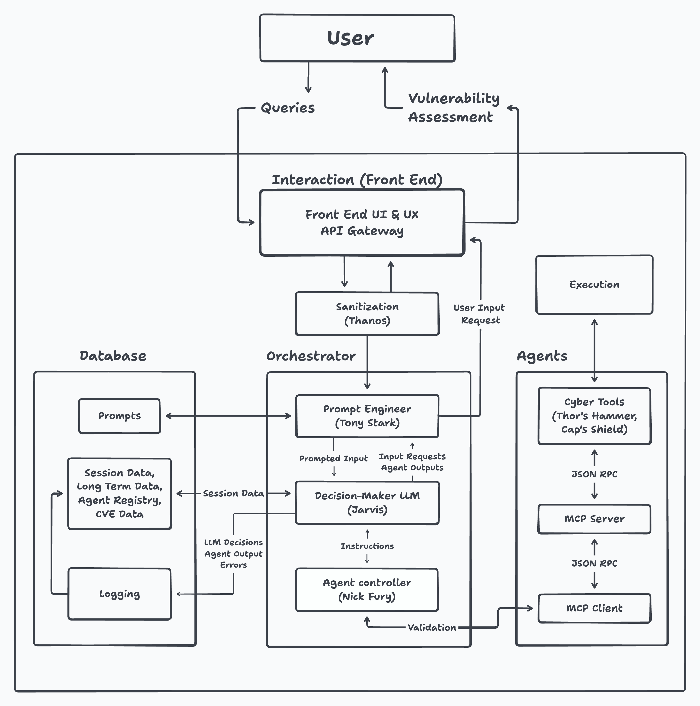

# 🛡️ VT-SaiBER (Agentic AI + Cybersecurity)

**AI-Powered Cybersecurity Agent Orchestration System**

VT-SaiBER is an advanced cybersecurity platform that combines AI agent orchestration with network reconnaissance tools. Inspired by the Avengers, it features specialized "Avenger" agents that work together to perform comprehensive security assessments using natural language commands.



## 🎯 What VT-SaiBER Does

- **🤖 AI Agent Orchestration**: Multiple specialized agents coordinate complex security tasks
- **🔍 Network Reconnaissance**: Advanced port scanning, service detection, and host discovery
- **🗣️ Natural Language Interface**: Ask questions in plain English, get intelligent security analysis
- **🔒 Ethical Scanning**: Built-in input validation and security controls
- **📊 Structured Reporting**: Comprehensive results with actionable insights
- **🛠️ Extensible Architecture**: Easy to add new agents and capabilities

## 🏗️ Architecture Overview

### Core Components
```bash
VT-SaiBER/
├── orchestrator/ # Agent coordination system
│ ├── nick_fury.py # Agent Controller ("Avenger Controller")
│ ├── tony_stark.py # Prompt Engineering ("Tony Stark")
│ ├── jarvis.py # LLM Integration ("Jarvis")
│ ├── interfaces.py # Component contracts
│ └── mocks.py # Testing utilities
├── avengers/ # Specialized agents
│ ├── vision_agent.py # Network reconnaissance
│ ├── base_avenger.py # Agent interface
│ └── vision_task.py # Agent tasks
├── interaction/ # User interfaces
│ ├── api/ # REST API (FastAPI)
│ │ ├── routes.py # API endpoints
│ │ └── thanos.py # Input validation
├── tools/ # External tool integrations
│ └── vision/ # Nmap-based scanning
│ ├── vision_mcp_server.py # MCP server
│ └── vision_mcp.py # MCP client
├── blueprints/ # Data models & schemas
│ └── schemas.py # Pydantic models
└── database/ # Configuration & data
├── avenger_registry.json # Agent definitions
├── avenger_prompts/ # LLM prompts
└── logger/ # Application logs
```

### Agent Roles (Inspired by Avengers)

- **Nick Fury**: Agent Controller - coordinates task execution across agents
- **Tony Stark**: Prompt Engineer - crafts optimal prompts for LLM interactions
- **Jarvis**: AI Assistant - handles LLM API communications
- **Vision**: Network Scanner - performs Nmap-based reconnaissance
- **Thanos**: Input Validator - ensures safe, valid user inputs

## 🚀 Quick Start

### Prerequisites

- **Python 3.12+**
- **Nmap** installed on system
- **Google AI API Key** (for ADK frontend)

### Installation

1. **Clone the repository**
   ```bash
   git clone <repository-url>
   cd VT-SaiBER
   ```

2. **Install dependencies**
   ```bash
   pip install -r requirements.txt
   ```

3. **Set up Google AI API**
   ```bash
   export GOOGLE_API_KEY="your-google-ai-api-key-here"
   ```

## 🎮 Usage

### Option 1: MCP Server Only

Run the network scanning tools directly:

```bash
# Start MCP server
python tools/vision/vision_mcp_server.py
```

The server exposes these tools via HTTP:
- `ping_scan` - Host discovery
- `quick_scan` - Fast port scanning
- `port_scan` - Specific port scanning
- `service_scan` - Service version detection
- `comprehensive_scan` - Full security assessment

### Option 2: Agent Testing

Test individual components:

```bash
# Test vision agent
python tests/vision_agent_test.py
```

## 📚 API Documentation

### REST API (Under Development)

The FastAPI backend will provide:

```http
POST /api/scan
{
  "prompt": "Scan 192.168.1.1 for open ports",
  "session_id": "optional-session-id"
}
```

```json
Response:
{
  "summary": "Found 3 open ports...",
  "results": [...],
  "session_id": "session-123"
}
```

### MCP Protocol

VT-SaiBER uses the Model Context Protocol for tool integration:

**Server**: `tools/vision/vision_mcp_server.py`
- Runs on `http://localhost:8000`
- Exposes 11 network scanning tools
- SSE transport for real-time communication

**Client**: `tools/vision/vision_mcp.py`
- Async HTTP client for MCP server
- Converts responses to VisionScanResult objects
- Used by VisionAgent for actual scanning

## 🔧 Configuration

### Environment Variables

```bash
# Required for Google ADK
GOOGLE_API_KEY=your-api-key-here
GOOGLE_GENAI_USE_VERTEXAI=False
```

### Security Configuration

Edit `config.yaml` for security settings:

```yaml
security:
  allowed_target_scopes:
    - "192.168.1.0/24"    # Your network ranges
    - "10.0.0.0/8"        # Private networks
```

### Agent Registry

Modify `database/avenger_registry.json` to add new agents:

```json
{
  "NewAgent": {
    "description": "Your new security agent",
    "module_path": "avengers.new_agent",
    "class_name": "NewAgent",
    "capabilities": [...]
  }
}
```

## 🧪 Testing

Run the test suite:

```bash
# Run all tests
python -m pytest tests/

# Test specific components
python tests/vision_agent_test.py

# Test MCP server
python tools/vision/vision_mcp_server.py --test
```

## 🛠️ Development

### Adding New Agents

1. **Create agent class** in `avengers/`
   ```python
   from avengers.base_avenger import BaseAvenger
   
   class NewAgent(BaseAvenger):
       async def execute(self, task) -> AvengerResult:
           # Your agent logic here
           pass
   ```

2. **Register in database**
   ```json
   {
     "NewAgent": {
       "description": "My new agent",
       "module_path": "avengers.new_agent",
       "class_name": "NewAgent"
     }
   }
   ```

3. **Update Nick Fury** to instantiate your agent

### Adding New Tools

1. **Create MCP tool** in `tools/vision/vision_mcp_server.py`
   ```python
   @mcp.tool(description="My new security tool")
   def my_new_tool(target: str) -> dict:
       # Tool implementation
       pass
   ```

2. **Add client method** in `tools/vision/vision_mcp.py`
   ```python
   async def my_new_tool(self, target: str) -> VisionScanResult:
       return await self._call_tool("my_new_tool", target=target)
   ```


### Development Setup

```bash
# Clone and setup
git clone <repo-url>
cd VT-SaiBER
python -m venv saiber_env
source saiber_env/bin/activate  # On Windows: saiber_env\Scripts\activate
pip install -r requirements.txt

# Run MCP server
python tools/vision/vision_mcp_server.py

# Run development server
streamlit run main.py
```

## 📋 Roadmap

### Phase 1 (Current)
- ✅ Agent orchestration system
- ✅ Vision network scanning agent
- ✅ MCP server/client implementation
- ✅ Google ADK web frontend
- ✅ Input validation & security

### Phase 2 (Upcoming)
- ✅ REST API endpoints
- ✅ Additional security agents (WAF, vulnerability scanner)
- 🔄 Session management
- 🔄 Report generation
- 🔄 Multi-user support
- 🔄 Plugin system for custom agents
- 🔄 Integration with SIEM systems
- 🔄 Automated response capabilities
- 🔄 Machine learning for threat detection

## 🛡️ Security & Ethics

**⚠️ Important Security Notice**

VT-SaiBER is designed for **authorized security testing only**. Always ensure you have explicit permission before scanning any network or system.

### Built-in Security Features
- **Input Validation**: Thanos validates all inputs against allowed target ranges
- **Rate Limiting**: Built-in delays and rate controls
- **Ethical Scanning**: Warns about intrusive scan types
- **Audit Logging**: All actions are logged for accountability

### Responsible Disclosure
If you discover security vulnerabilities in VT-SaiBER itself, please:
1. **DO NOT** create public issues
2. Email security concerns to: [security contact]
3. Allow 90 days for fixes before public disclosure

## 📄 License
This project is licensed under the MIT License - see the [LICENSE](LICENSE) file for details.

## 🙏 Acknowledgments
- **Avengers Inspiration**: Marvel's superhero team for the naming scheme
- **Nmap**: The gold standard for network scanning
- **Google ADK**: For the AI agent development framework
- **FastMCP**: For the model context protocol implementation

## 📞 Support
- **Documentation**: [Link to full docs]
- **Issues**: [GitHub Issues]
- **Discussions**: [GitHub Discussions]
- **Security**: [Security contact]

---
**Built with ❤️ for ethical cybersecurity research and education**

🛡️ **Stay secure, scan responsibly!** 🛡️